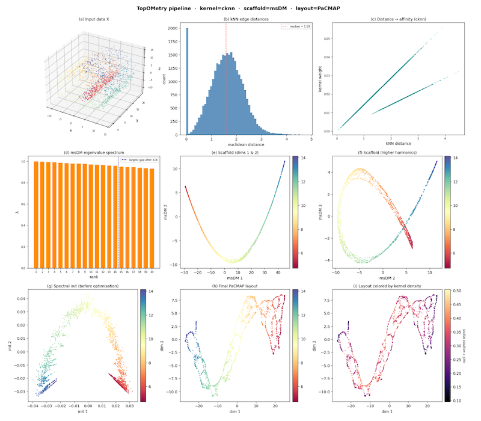

[](https://opensource.org/licenses/MIT)
[](https://colab.research.google.com/github/HauserGroup/topometryNoSC/blob/master/notebooks/example.ipynb)
[](https://github.com/astral-sh/uv)
[](https://pre-commit.com/)
[](https://orcid.org/0000-0002-2841-7284)

# About topometry-nosc

> **Provenance.** `topometry-nosc` is an independently maintained, heavily
> modified fork of [TopOMetry](https://github.com/davisidarta/topometry) by
> David S Oliveira (original copyright and MIT license preserved). Its API,
> internals and behaviour may differ substantially from upstream. It is **not**
> an official release of, affiliated with, or endorsed by the original project.
> The import package is still named `topo`, so it cannot be installed alongside
> the upstream `topometry` distribution in the same environment. Please cite
> both this fork and the original work (see `CITATION.cff`).

**topometry-nosc** is a Python toolkit for **Manifold Learning**, **Dimensionality Reduction**, and **Spectral Clustering**. It explores high-dimensional data by approximating the **Laplace-Beltrami Operator (LBO)** via **Continuous k-Nearest Neighbors (CkNN)** and **Diffusion Maps**. The pipeline learns **neighborhood graphs → Laplace–Beltrami–type operators → spectral scaffolds → refined graphs** to find clusters and build low-dimensional layouts.

- **scikit-learn–style transformers** compatible with standard machine learning workflows
- **Diffusion Maps** and **multiscale spectral scaffolds** for geometry preservation
- **Operator-native metrics** to quantify geometry preservation and **Riemannian diagnostics** to evaluate distortion in visualizations
- Designed for **large, diverse datasets**

For background, see the preprint: https://doi.org/10.1101/2022.03.14.484134

## Geometry-first rationale (short)

We approximate the **Laplace–Beltrami operator (LBO)** by learning well-weighted similarity graphs and their Laplacian/diffusion operators. The **eigenfunctions** of these operators form an orthonormal basis—the **spectral scaffold**—that captures the dataset’s intrinsic geometry across scales. This view connects to **Diffusion Maps**, **Laplacian Eigenmaps**, and related kernel eigenmaps, and enables downstream tasks such as clustering and graph-layout optimization with geometry preserved.

## When to use TopoMetry

Use TopoMetry when you want:

- Geometry-faithful representations beyond variance maximization (e.g., PCA)
- Robust low-dimensional views and clustering from operator-grounded features
- Quantitative **operator-native** metrics to compare methods and parameter choices
- Reproducible, **non-destructive** pipelines

Empirically, TopoMetry often outperforms PCA-based pipelines and stand-alone layouts. Still, **let the data decide**—TopoMetry includes metrics and reports to support evidence-based choices.

For practical guidance on UMAP vs. TopoMetry, target-aware embedding checks, and
layout troubleshooting, see [`docs/faq.md`](docs/faq.md).

### When not to use TopoMetry

- **Very small sample sizes** where the manifold hypothesis is weak
- Workflows needing **streaming/online** updates or **inverse transforms** (embedding new points without recomputing operators is not currently supported). If that’s critical, consider UMAP or parametric/autoencoder approaches—and you can still use TopoMetry to **audit geometry** or **estimate intrinsic dimensionality** to guide model design.

## Installation

> [!WARNING]
> **Do not install alongside the original `topometry`.** This fork ships the same
> import package name (`topo`). Installing both `topometry` and `topometry-nosc`
> in one environment makes them overwrite each other's files. `import topo` will
> **raise an error** if it detects both. Use a fresh virtualenv, or
> `pip uninstall topometry` first.

topometry-nosc is a standard, pip-installable package. The **core** install
depends only on numpy, scipy, scikit-learn, numba and joblib:

```bash
pip install topometry-nosc            # core
pip install "topometry-nosc[all]"     # core + plotting, dataframes, ANN backends and extra layouts
```

Optional features are grouped into extras — install only what you need:

| Extra        | Adds                                                        |
|--------------|------------------------------------------------------------|
| `plot`       | matplotlib (plotting)                                       |
| `pandas`     | pandas (DataFrame I/O)                                      |
| `ann`        | hnswlib (fast approximate nearest neighbors)               |
| `amg`        | pyamg (algebraic-multigrid `eigensolver='amg'`)            |
| `layouts`    | pacmap, pymde, trimap (extra projections)                  |
| `notebooks`  | jupyterlab / ipywidgets                                    |
| `all`        | everything above                                           |

Missing an optional dependency raises a clear message telling you which extra to
install (e.g. `pip install topometry-nosc[plot]`).

### Development install

This project uses [uv](https://docs.astral.sh/uv/):

```bash
uv sync --all-extras   # package + all extras + dev tooling
uv run pytest -q       # run the tests
```


## Tutorials and documentation

Documentation for this fork: <https://HauserGroup.github.io/topometryNoSC/>
(installation, quickstart, concepts, and an auto-generated API reference).

The original upstream project's **(OLD)** [documentation](https://topometry.readthedocs.io/en/latest/) may still be useful for background, but describes the upstream API, which differs from this fork.


## Minimal example

```python
import topo as tp
from sklearn.datasets import make_swiss_roll

X, color = make_swiss_roll(n_samples=2000, noise=0.5, random_state=42)

# Fit runs the whole pipeline: kNN -> kernel -> eigenbasis -> scaffold ->
# refined graph -> 2-D layouts (defaults: MAP + PaCMAP).
tg = tp.TopOGraph()
tg.fit(X)

# Layouts computed during fit, available as attributes:
print(tg.TopoMAP.shape)         # (2000, 2)
print(tg.msTopoPaCMAP.shape)    # (2000, 2)

# Compute another layout on demand from the same fitted model:
emb = tg.project(projection_method="PaCMAP")
```

## Step-by-step (under the hood)

`TopOGraph.fit` above chains four building blocks. Each is a standalone,
scikit-learn-style estimator you can use on its own — swap one out, stop early,
or feed your own matrices in:

```python
from sklearn.datasets import make_swiss_roll

from topo.base.ann import kNN
from topo.tpgraph.kernels import Kernel
from topo.spectral.eigen import EigenDecomposition
from topo.layouts.projector import Projector

X, color = make_swiss_roll(n_samples=2000, noise=0.5, random_state=42)

# 1. k-nearest-neighbor graph (sparse). Useful on its own.
knn_graph = kNN(X, n_neighbors=15, metric="euclidean")

# 2. Affinity kernel -> Laplace-Beltrami-type operator.
kernel = Kernel(n_neighbors=15, metric="euclidean").fit(X)
affinity = kernel.K              # sparse affinity matrix
operator = kernel.P              # diffusion operator

# 3. Spectral scaffold: eigendecompose the operator (diffusion maps).
eig = EigenDecomposition(n_components=20, method="DM").fit(kernel)
scaffold = eig.transform(kernel) # (2000, ~20) eigen-coordinates

# 4. 2-D layout from the scaffold (any feature matrix works here).
emb = Projector(n_components=2, projection_method="MAP").fit_transform(scaffold)
print(emb.shape)                 # (2000, 2)
```

Each step maps to a documented class: `kNN`, `Kernel`, `EigenDecomposition`,
`Projector`. See the [API reference](https://HauserGroup.github.io/topometryNoSC/api/)
and the [step-by-step tutorial](https://HauserGroup.github.io/topometryNoSC/tutorials/step-by-step/).

## Output

Example `TopOGraph` fit:



## Changelog

**v2.0.0** — Core-only release
- Removed single-cell / scanpy / AnnData wrappers (now a standalone geometry toolkit)
- Core API unchanged: `TopOGraph`, spectral scaffolds, graph operators, layouts, metrics, plotting

#### Citation

---

```
@article {Oliveira2022.03.14.484134,
	author = {Oliveira, David S and Domingos, Ana I. and Velloso, Licio A},
	title = {TopoMetry systematically learns and evaluates the latent geometry of single-cell data},
	elocation-id = {2022.03.14.484134},
	year = {2025},
	doi = {10.1101/2022.03.14.484134},
	publisher = {Cold Spring Harbor Laboratory},
	URL = {https://www.biorxiv.org/content/early/2025/10/15/2022.03.14.484134},
	eprint = {https://www.biorxiv.org/content/early/2025/10/15/2022.03.14.484134.full.pdf},
	journal = {bioRxiv}
}
```
