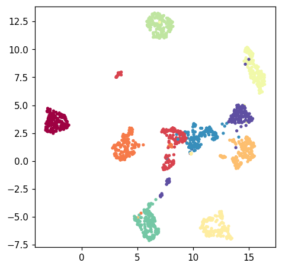
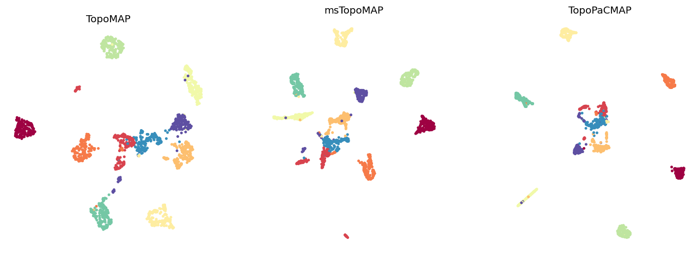
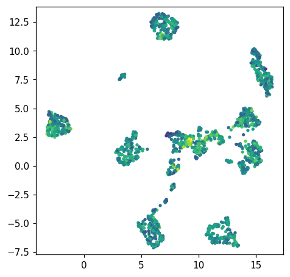
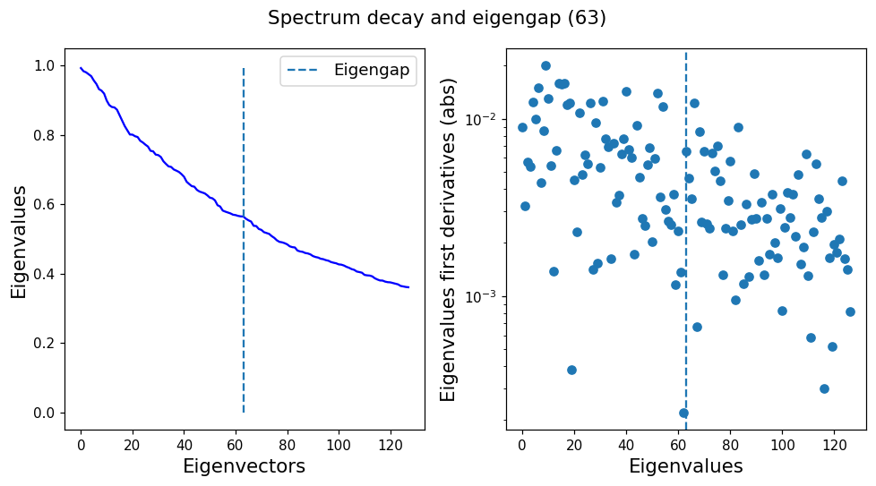
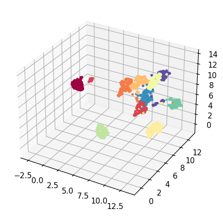

# Plotting

This walkthrough covers the built-in plotting helpers in `topo.plot` and how to
colour, compare and save figures. Every image below was produced by the code
shown next to it, on the same example data as the
[step-by-step tutorial](step-by-step.md).

Plotting is built on [matplotlib](https://matplotlib.org/), so install the plot
extra:

```bash
pip install "topometry-nosc[plot]"
```

## Setup

We fit once and reuse the result for every plot:

```python
import topo as tp
from data import load_cells

X, labels, label_names = load_cells(return_names=True)

tg = tp.TopOGraph(random_state=0)
tg.fit(X)
```

`tg.fit` computes the 2-D layouts; the plots below just draw them. Every
`topo.plot` function returns a matplotlib `Figure`, so you can show it in a
notebook or save it with `fig.savefig(...)`.

## 1. A basic scatter

`scatter` draws a 2-D layout, one point per row, coloured by group:

```python
fig = tp.plot.scatter(tg.TopoMAP, labels=labels, pt_size=6)
```



`labels` are mapped through a colormap (`cmap`, default `"Spectral"`). Pass any
per-row array — integer groups here, or a continuous value (see §3).

## 2. Compare layouts side by side

`tg.fit` produces several layouts. Drawing them together makes it easy to pick
the one that tells the clearest story. Here we use matplotlib directly on the
embedding arrays:

```python
import matplotlib.pyplot as plt

fig, axes = plt.subplots(1, 3, figsize=(15, 5))
for ax, (emb, title) in zip(
    axes,
    [(tg.TopoMAP, "TopoMAP"),
     (tg.msTopoMAP, "msTopoMAP"),
     (tg.TopoPaCMAP, "TopoPaCMAP")],
):
    ax.scatter(emb[:, 0], emb[:, 1], c=labels, s=5, cmap="Spectral")
    ax.set_title(title)
    ax.set_aspect("equal")
    ax.axis("off")
```



Each layout is just an `(n_rows, 2)` array, so anything you can do with
matplotlib works directly.

## 3. Colour by a continuous value

Instead of groups, colour by any per-row number — an expression level, a score,
or here the total intensity of each row. Use a sequential colormap:

```python
intensity = X.sum(axis=1)
fig = tp.plot.scatter(tg.TopoMAP, labels=intensity, pt_size=6, cmap="viridis")
```



## 4. The eigenspectrum (scree plot)

`tg.eigenspectrum()` shows how much structure each successive pattern carries —
useful for judging how many components hold real signal:

```python
fig = tg.eigenspectrum()
```



The dashed line marks the estimated eigengap, a rough cut between signal and the
flat noise tail.

## 5. A 3-D scatter

Ask for a 3-component layout and draw it with `scatter3d`:

```python
emb3d = tg.project(n_components=3, projection_method="MAP")
fig = tp.plot.scatter3d(emb3d, labels=labels, pt_size=6)
```



## Saving figures

Every helper returns a `Figure`, so save in any format matplotlib supports:

```python
fig = tp.plot.scatter(tg.TopoMAP, labels=labels)
fig.savefig("topomap.png", dpi=200, bbox_inches="tight")  # or .pdf, .svg
```

In a Jupyter notebook the figure also displays inline automatically.
